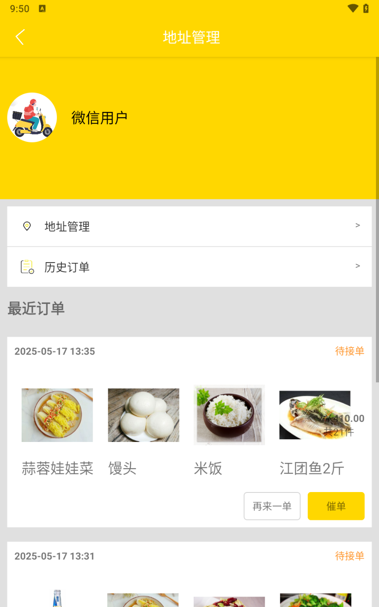
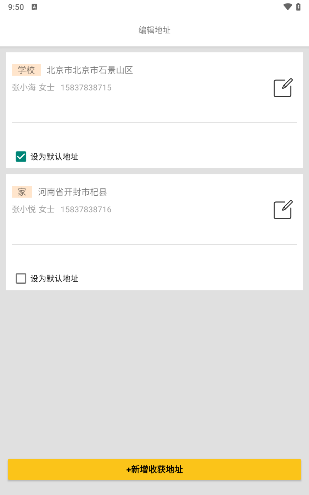
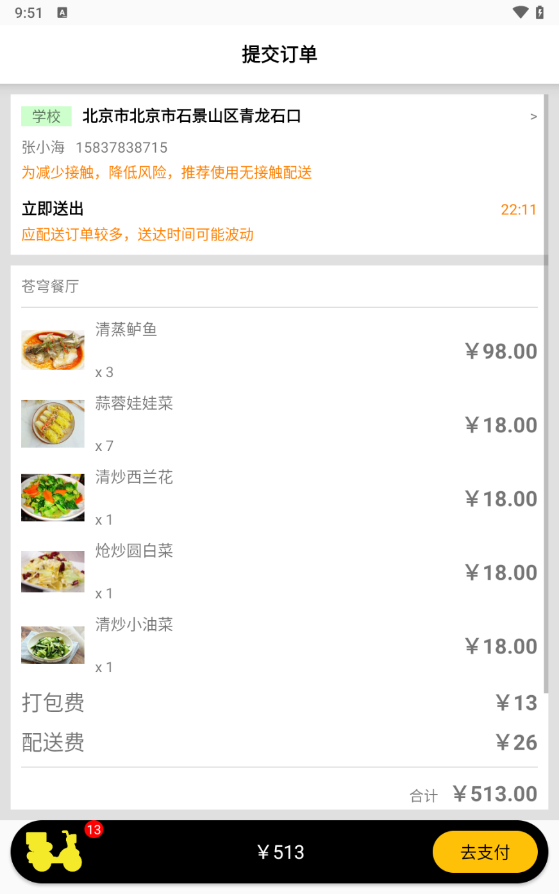
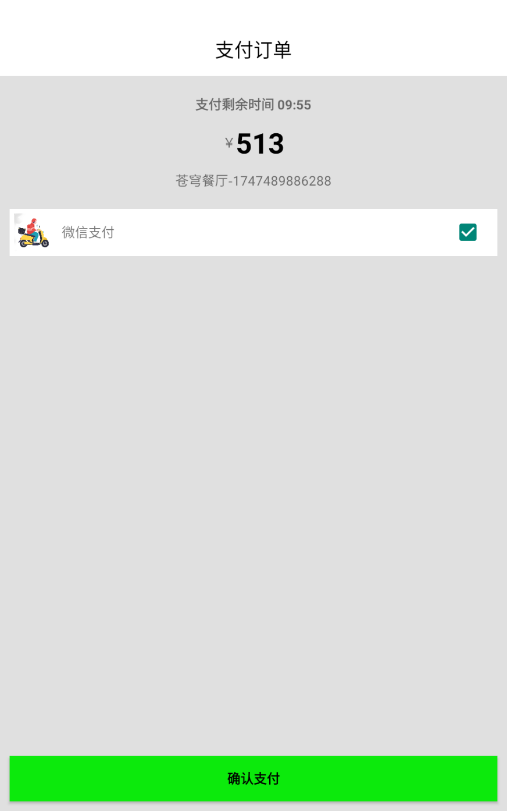
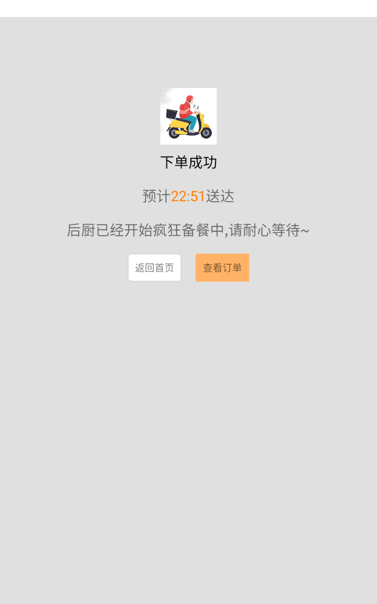

# 苍穹外卖安卓版

**项目简介**

该项目是仿苍穹外卖小程序制作的安卓版，使用Kotlin语言开发，采用MVVM架构 + Google Jetpack组件搭建项目，使用的是苍穹外卖后端的API实现的相关功能 。

**tips**: 由于作者也是学习安卓初期，代码有点不规范，请见谅！大佬求放过！！

**技术栈**

Kotlin、Glide、Retrofit、OkHttp、ViewPager2、Gson等..

**项目截图**

<table>
  <tr>
    <td></td>
    <td></td>
    <td></td>
  </tr>
  <tr>
    <td></td>
     <td></td>
     <td></td>
  </tr>
    <tr>
    <td></td>
     <td></td>
     <td></td>
  </tr>
</table>
